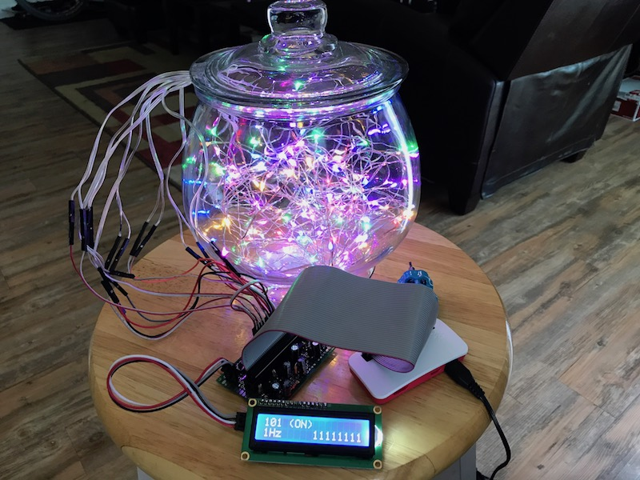

# lightshow

A fun little home project.

On the hardware side this consists of:
* Raspberry pi zero. [$26.00](https://www.amazon.com/Raspberry-Pi-Zero-Wireless-Official/dp/B06XD18H6K/ref=sr_1_7?s=electronics&ie=UTF8&qid=1497980214&sr=1-7&keywords=pi+zero)
* Arduino LCD screen and I2C adapter. [$8.79](https://www.amazon.com/gp/product/B01985FB6A/ref=oh_aui_detailpage_o03_s00?ie=UTF8&psc=1)
* 8 20-LEDs/2m fairy string lights. [$13.99](https://www.amazon.com/gp/product/B06XBV7D77/ref=oh_aui_detailpage_o02_s00?ie=UTF8&psc=1)
* A few basic electronics components: 2N2222 transistors, resistors (47kΩ and 22Ω) and 100µF capacitors. $5.00
* two push buttons, a prototyping circuit board, and a bunch of wires. $2.00
* A 1/2 gallon clear vase/terrarium (optional) [$15.95](https://www.amazon.com/Syndicate-Sales-Gallon-Footed-Terrarium/dp/B000RMTG4M/ref=sr_1_1?ie=UTF8&qid=1497980867&sr=8-1&keywords=1%2F2+gallon+terrarium)

On the software side:
* Raspbian
* Python REST server using Flask
* Python Socket.IO for push notifications
* an iOS app to control the light show remotely.

